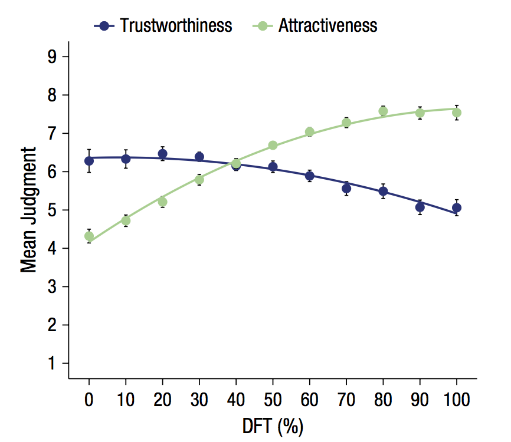

```{r}
articleID <- "4-1-2015_PS" # insert the article ID code here e.g., "10-3-2015_PS"
reportType <- 'final'
pilotNames <- "Sean Zion, Mufan Luo" # insert the pilot's name here e.g., "Tom Hardwicke". If there are multiple pilots enter both names in a character string e.g., "Tom Hardwicke, Bob Dylan"
copilotNames <- "Erica Yoon" # insert the co-pilot's name here e.g., "Michael Frank". If there are multiple co-pilots enter both names in a character string e.g., "Tom Hardwicke, Bob Dylan"
pilotTTC <- 500 # insert the pilot's estimated time to complete (in minutes, fine to approximate) e.g., 120
copilotTTC <- 120 # insert the co- pilot's estimated time to complete (in minutes, fine to approximate) e.g., 120
pilotStartDate <- as.Date("11/5/2017", format = "%m/%d/%y") # insert the pilot's start date in US format e.g., as.Date("01/25/18", format = "%m/%d/%y")
copilotStartDate <- as.Date("10/19/2018", format = "%m/%d/%y") # insert the co-pilot's start date in US format e.g., as.Date("01/25/18", format = "%m/%d/%y")
completionDate <- as.Date("", format = "%m/%d/%y") # copilot insert the date of final report completion (after any necessary rounds of author assistance) in US format e.g., as.Date("01/25/18", format = "%m/%d/%y")
```

-------

#### Methods summary: 

The authors conducted a repeated measures ANOVA using DFT as a repeated measure and judgement type as between-subjects factor. They report a significant main effect of DFT and a signficant interaction effect of DFT (Distance from the typical face) with judgment type (trustworthiness vss. attractiveness). They plot mean judgement for attractiveness and mean judgement for trustworthiness across the ten faces in figure 2.

------

#### Target outcomes: 
> We complemented our by-face analysis with a by-participant
repeated measures analysis of variance
(ANOVA) with DFT as a repeated measure and judgment
type (trustworthiness vs. attractiveness) as a between-subjects
factor. The observed effects supported the same
conclusions as the by-face analysis. The main effect of
DFT was significant, F(10, 37) = 4.05, p < .001, ηp2 = .52.
More important, this main effect was qualified by a significant
interaction, F(10, 37) = 5.95, p < .001, ηp2 = .62.

> Fig.2
------

```{r global_options, include=FALSE}
knitr::opts_chunk$set(echo=TRUE, warning=FALSE, message=FALSE)
```

## Step 1: Load packages

```{r}
library(tidyverse) # for data munging
library(knitr) # for kable table formating
library(haven) # import and export 'SPSS', 'Stata' and 'SAS' Files
library(readxl) # import excel files
library(CARPSreports) # custom report functions
library(ggplot2)
library(psych)
library(plyr)
library(corrplot)
library(car)
library(ez) #For ANOVA Models
library(afex) #to run aov_ez
```

```{r}
# Prepare report object. This will be updated automatically by the reproCheck function each time values are compared.
reportObject <- data.frame(dummyRow = TRUE, reportedValue = NA, obtainedValue = NA, valueType = NA, percentageError = NA, comparisonOutcome = NA, eyeballCheck = NA)
```

## Step 2: Load data

```{r}
faces <- read.csv("data/Experiment _1_Rps _v2.csv")
```

## Step 3: Tidy data

```{r}
faces$subid <- c(1:48) #adding a new column for subject ID

faces_tidy <- faces %>%
  gather(key="DFT_Rating", value, 3:35) %>%
  separate(DFT_Rating, c("dft", "value_trial"), sep="T_") %>%
  separate(value_trial, c("dft_value", "trial_num"), sep="_") %>%
  mutate(trial_num = paste("trial", trial_num, sep="")) %>%
  mutate(dft_value = as.numeric(dft_value)) %>%
  mutate(trust_attract = fct_recode(factor(Trust1Attrc0), "trust" = "1", "attractive" = "0")) %>%
  select(-dft, -Trust1Attrc0)
```

## Step 4: Run analysis

### Pre-processing

```{r}
faces_prepr <- faces_tidy %>%
  spread(trial_num, value) %>%
  transmute(subid, dft_value, trust_attract, 
            avg_value = rowMeans(select(., trial1:trial3))) %>%
  mutate(trust_attract = factor(trust_attract),
         dft_value = factor(dft_value),
         subid = factor(subid))
```

### Descriptive statistics

```{r}
#Mean and SD for ratings across judement type (trustworthy / attractiveness)
desc_stat <- faces_tidy %>%
  group_by(trust_attract, dft_value) %>%
  dplyr::summarise(mean = mean(value), sd = sd(value)) %>%
  gather(stat, value, -trust_attract, -dft_value) %>%
  unite(judg_stat, trust_attract, stat) %>%
  spread(judg_stat, value) 

print(desc_stat)
```

### Inferential statistics

> by-participant repeated measures analysis of variance (ANOVA) with DFT as a repeated measure and judgment type (trustworthiness vs. attractiveness) as a between-subjects factor. The observed effects supported the same conclusions as the by-face analysis. The main effect of DFT was significant, F(10, 37) = 4.05, p < .001, ηp2 = .52. More important, this main effect was qualified by a significant interaction, F(10, 37) = 5.95, p < .001, ηp2 = .62.
### Model 1:

```{r, model 1}
#Model 1 - Repeated Measures ANOVA 
model1 <- with(faces_prepr, aov(avg_value ~ (dft_value * trust_attract) + Error(subid / (dft_value))))
model1_summary <- summary(model1)
```

Our goal was to reproduce the analysis of the authors in experiment one. We conducted a by-participant repeated measures analysis of variance using the value of DFT as a repeated measure and judgment type (either trustworthiness or attractiveness) as a between-subjects factor.

### Model 2: 

```{r, mod 2}
#Model 2 - Repeated Measures ANOVA
model2 <- ezANOVA(data = faces_prepr, dv = .(avg_value), wid = .(subid), within = .(dft_value), between = .(trust_attract), detailed = TRUE, return_aov=T)

model2$ANOVA
print(model2)
```

Because we found different outcomes above and we could not obtain all the values reported by the authors, here we try a slightly different model using a different R package.


### Model 3 (Added by co-pilot):

```{r}
model3 <- aov_ez(data = faces_prepr,
       id = "subid",
       between = "trust_attract",
       dv = "avg_value",
       within = c("dft_value"),
       anova_table = list(correction = 'none', es = 'pes'))

print(model3)
```

This model gives the same results as model1. The stats from model 3 will be used to compare against the original stats.

### Figure 2 Replication:

```{r, Fig 2 Rep}
#Figure 2 Replication

faces_tidy %>%
  mutate(dft_value = as.numeric(as.character(dft_value))) %>%
  group_by(trust_attract, dft_value) %>%
  dplyr::summarise(mean = mean(value), sd = sd(value)) %>%
  mutate(ci_lower = mean - sd/sqrt(48),
         ci_upper = mean + sd/sqrt(48)) %>%
  ggplot(., aes(x = dft_value, y=mean, col=trust_attract)) +
  geom_smooth(aes(group=trust_attract), se=F) +
  geom_linerange(aes(ymin = ci_lower, ymax = ci_upper)) +
  xlab('DFT Value') + 
  ylab('Mean Judgment') + 
  scale_y_continuous(limits= c(0.5, 9.5), breaks=seq(0,10,1)) +
  scale_x_continuous(breaks=seq(0,100,10))
```

Replicated Figure 2: Mean trustworthiness and attractiveness judgments as a function of DFT. Error bars represent within-subjects standard errors (computed by sd / number of participants).




### Errors:


```{r}
# Main effect of DFT:

#ANOVA Output - Main Effect of DFT
reportObject <- reproCheck(reportedValue = "4.05", obtainedValue = model3$anova_table$F[2], valueType = 'F')

#ANOVA Output - num df
reportObject <- reproCheck(reportedValue = "10", obtainedValue = model3$anova_table$`num Df`[2], valueType = 'df')

#ANOVA Output - den df
reportObject <- reproCheck(reportedValue = "37", obtainedValue = model3$anova_table$`den Df`[2], valueType = 'df')

#ANOVA Output - p value
reportObject <- reproCheck(reportedValue = "<.001", obtainedValue = model3$anova_table$`Pr(>F)`[2], valueType = 'p', eyeballCheck = TRUE)

# Interaction:

#ANOVA Output - Interaction Effect of DFT with Judgment Type
reportObject <- reproCheck(reportedValue = "5.95", obtainedValue = model3$anova_table$F[3], valueType = 'F')

#ANOVA Output - num df
reportObject <- reproCheck(reportedValue = "10", obtainedValue = model3$anova_table$`num Df`[3], valueType = 'df')

#ANOVA Output - den df
reportObject <- reproCheck(reportedValue = "37", obtainedValue = model3$anova_table$`den Df`[3], valueType = 'df')

#ANOVA Output - p value
reportObject <- reproCheck(reportedValue = "<.001", obtainedValue = model3$anova_table$`Pr(>F)`[3], valueType = 'p', eyeballCheck = TRUE)


```

## Step 5: Conclusion

In conclusion, we attempted to replicate a main finding from the Sofer et al., paper. The authors conducted a by-participant repeated measures analysis of variance (ANOVA) with DFT as a repeated measure and judgment type (trustworthiness vs. attractiveness) as a between-subjects factor. They report a significant main effect of DFT: F(10, 37) = 4.05, p < .001, ηp2 = .52. The authors also found a significant interaction, F(10, 37) = 5.95, p < 0.001, ηp2 = 0.62.

Our attempt to replicate the reported F-scores and Dfs failed, even though the general conclusion remained the same, in that the main effect and interaction remained significant below .001. We believe this could be due to confusion over the number of subjects included. As reported above, it looks as though the authors only included 38 of the 48 subjects, indicated by a DF=37, or this was a typo in the manuscript. If certain participants were excluded from the analysis, it was not indicated other than the above DF error.

We found nearly identical values in two different ANOVA models, both of which differed from the authors reported findings.

We were generally able to replicate the figure depicting mean trustworthiness and attractiveness judgments as a function of distance of the face from the typical face (DFT).


```{r}
Author_Assistance = FALSE # was author assistance provided? (if so, enter TRUE)

Insufficient_Information_Errors <- 0 # how many discrete insufficient information issues did you encounter?

# Assess the causal locus (discrete reproducibility issues) of any reproducibility errors. Note that there doesn't necessarily have to be a one-to-one correspondance between discrete reproducibility issues and reproducibility errors. For example, it could be that the original article neglects to mention that a Greenhouse-Geisser correct was applied to ANOVA outcomes. This might result in multiple reproducibility errors, but there is a single causal locus (discrete reproducibility issue).

locus_typo <- 0 # how many discrete issues did you encounter that related to typographical errors?
locus_specification <- 0 # how many discrete issues did you encounter that related to incomplete, incorrect, or unclear specification of the original analyses?
locus_analysis <- 0 # how many discrete issues did you encounter that related to errors in the authors' original analyses?
locus_data <- 0 # how many discrete issues did you encounter that related to errors in the data files shared by the authors?
locus_unidentified <- 1 # how many discrete issues were there for which you could not identify the cause

Affects_Conclusion <- 0 # Do any reproducibility issues encounter appear to affect the conclusions made in the original article? This is a subjective judgement, but you should taking into account multiple factors, such as the presence/absence of decision errors, the number of target outcomes that could not be reproduced, the type of outcomes that could or could not be reproduced, the difference in magnitude of effect sizes, and the predictions of the specific hypothesis under scrutiny.
```

```{r}
reportObject <- reportObject %>%
  filter(dummyRow == FALSE) %>% # remove the dummy row
  select(-dummyRow) %>% # remove dummy row designation
  mutate(articleID = articleID) %>% # add the articleID 
  select(articleID, everything()) # make articleID first column

# decide on final outcome
if(any(reportObject$comparisonOutcome != "MATCH") | Insufficient_Information_Errors > 0){
  finalOutcome <- "Failure without author assistance"
  if(Author_Assistance == T){
    finalOutcome <- "Failure despite author assistance"
  }
}else{
  finalOutcome <- "Success without author assistance"
  if(Author_Assistance == T){
    finalOutcome <- "Success with author assistance"
  }
}

# collate report extra details
reportExtras <- data.frame(articleID, pilotNames, copilotNames, pilotTTC, copilotTTC, pilotStartDate, copilotStartDate, completionDate, Author_Assistance, finalOutcome, Insufficient_Information_Errors, locus_typo, locus_specification, locus_analysis, locus_data, locus_unidentified)

# save report objects
if(reportType == "pilot"){
  write_csv(reportObject, "pilotReportDetailed.csv")
  write_csv(reportExtras, "pilotReportExtras.csv")
}

if(reportType == "final"){
  write_csv(reportObject, "finalReportDetailed.csv")
  write_csv(reportExtras, "finalReportExtras.csv")
}
```

# Session information

```{r session_info, include=TRUE, echo=TRUE, results='markup'}
devtools::session_info()
```

